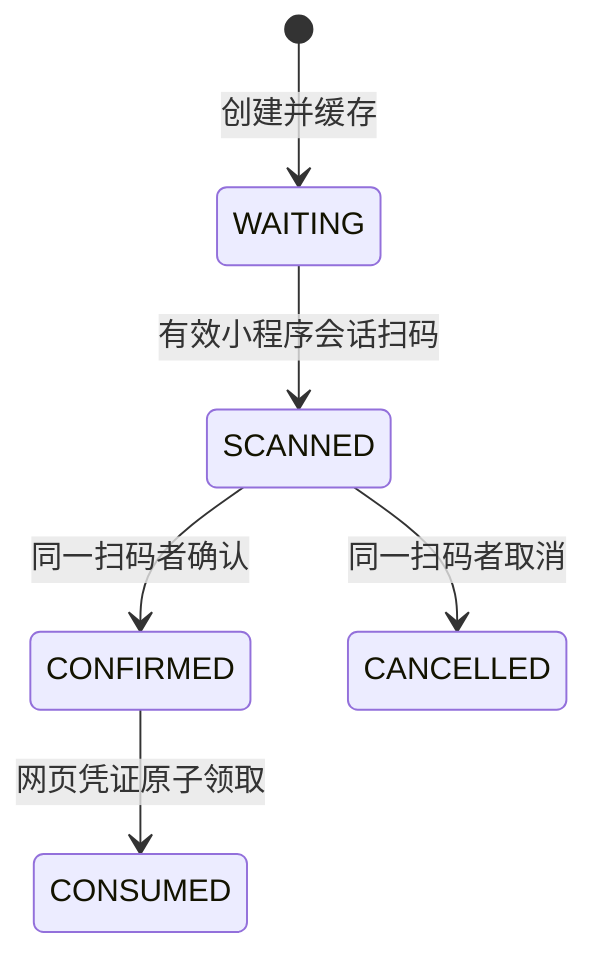

# 阶段 5.5：小程序扫码网页登录

后端已接通微信小程序码生成、3 分钟 Redis 场景、小程序扫码与显式确认，以及网页端一次性领取 JWT。登录沿用 `/auth/login`，新增完整授权名称 `qr`；网页令牌包含现有部门、角色、岗位、菜单与数据权限，采用领取时的网页客户端配置和请求终端信息。

## 配置

功能默认关闭。部署配置示例中的客户端 ID 必须换成实际 `sys_client.client_id`，小程序客户端启用 `xcx` grant，网页客户端启用 `qr` grant。没有添加 SQL 种子或修改现有客户端。

```yaml
xcx:
  enabled: ${XCX_ENABLED:false}
  qr-enabled: ${XCX_QR_ENABLED:false}
  apps:
    wx0123456789abcdef:
      enabled: true
      secret: ${XCX_APP_SECRET:}
      client-ids: [mini-client, web-client]
      qr-client-ids: [web-client]
      qr-page: pages/login/index
      qr-env-version: release
```

`client-ids` 控制小程序登录/绑定及扫码者的实际 token 客户端；`qr-client-ids` 单独控制可被扫码登录的网页客户端。小程序在创建、查询、扫码、确认和领取时均需启用。页面路径不带前导 `/`，环境只支持 release/trial/develop；微信请求使用 `check_path=true`，所选环境必须存在对应页面。小程序业务页面、微信后台权限/IP 白名单和客户端访问策略需要部署方配置。小程序 token 的路径/IP 策略须允许 `/auth/qr/scan` 与 `/auth/qr/confirm`。

`WechatQrClient` 使用固定 `https://api.weixin.qq.com` 地址，先 POST `/cgi-bin/stable_token`（force_refresh=false），再 POST `/wxa/getwxacodeunlimit`，width=430。服务端密钥和 access_token 不进入业务响应、场景或会话。每次生成重新获取 stable_token，不在本地缓存供应商凭证。连接超时 5 秒，每个完整请求最长 10 秒，单次响应最多 1 MiB，拒绝重定向；PNG/JPEG 头标识与供应商 JSON 错误分开处理。供应商失败返回统一错误，不透传可能包含凭证的原文。没有引入旧微信 SDK 或额外依赖。

## 前端调用顺序

| 调用方 | 接口 | 请求与结果 |
|---|---|---|
| 网页 | POST `/auth/qr/create`，公开 | body=`{"appid":"wx0123456789abcdef","clientId":"web-client"}`；`R.data` 包含 scene、browserToken、img（data URL）、expireIn=180 |
| 网页 | POST `/auth/qr/status`，公开但需网页凭证 | body 包含 scene、browserToken、clientId；仅返回 `R.data.status`，不返回用户资料、openid 或 JWT |
| 小程序 | POST `/auth/login`，grant `xcx` | 使用新的 wx.login code 完成 [小程序登录](xcx-login.md)，须已有有效的系统账号绑定 |
| 小程序 | POST `/auth/qr/scan`，受保护 | Authorization Bearer 小程序 token + 匹配的 clientid；body=`{"scene":"二维码内场景号"}`；返回 clientId/clientKey 供确认页面展示目标客户端 |
| 小程序 | POST `/auth/qr/confirm`，受保护 | 同上；body=`{"scene":"场景号","confirmed":true}`；用户明确取消时传 false，confirmed 必填 |
| 网页 | POST `/auth/login`，grant `qr` | 收到 CONFIRMED 后提交下面 JSON；返回现有 `R<LoginVo>` 的 access_token/client_id/expire_in |

```json
{
  "clientId": "web-client",
  "grantType": "qr",
  "scene": "创建接口返回的32位场景号",
  "browserToken": "创建接口返回的43位网页凭证"
}
```

网页将 browserToken 留在当前页面内存，不能放入二维码、小程序参数、URL、日志或状态广播。二维码只含 scene；微信进入小程序时从页面 options.scene 读取该值。小程序先调用 scan，再展示目标客户端并等待用户点击确认/取消，不能在扫码后自动提交 confirmed=true。二维码登录不会自动注册或绑定账号；无绑定时先走现有绑定流程，再重新获取二维码。

网页按约 2 秒间隔轮询，共享 NAT 下应考虑每 IP 每分钟 120 次的状态限流；创建限制为每 IP 每分钟 10 次。停止轮询的条件是 CANCELLED、CONSUMED、场景错误或本地 180 秒期限到达；CONFIRMED 时只提交一次登录领取。接口创建/状态响应含 `Cache-Control: no-store`。过期、未知场景、凭证冲突和无效阶段返回统一业务错误，错误结构沿用既有 R.code 契约。

本批使用 REST 状态轮询完成网页通知，单体内无需旧 MQ 转发和 Socket.IO 房间发令牌。没有登记二维码 MQ 拓扑、监听器或 Socket.IO 房间；旧 Socket.IO 事件接口需要前端按以上新契约适配。这是通知方式变更，不能理解为旧 MQ/Socket.IO 业务接口已迁入。

## 状态与归属



所有状态共用原始 180 秒 TTL，查询和重扫不续期。Redis key 为 `auth:qr:scene:{scene}`，使用明确的 StringCodec 保存 JSON；场景号由 SecureRandom 生成 128 位随机数，网页凭证另生成 256 位随机数，Redis 只存其 SHA-256。`QrSceneStore` 的 Lua 在同一原子操作中比较原始 JSON、检查正数 PTTL，并用原剩余 TTL 写入下一状态；过期 key、无期限 key 或并发修改后的旧快照不能迁移。

扫码只接受服务端 `XcxLoginUser` 会话，与场景 appid 精确匹配；普通密码/网页 token 不能冒充小程序身份。服务端重新验证扫码客户端状态、xcx grant、app 客户端白名单、绑定所属用户、账号状态及共享账号锁定。第一个成功扫码者占有场景，同一扫码者可重复 scan，其他身份不能覆盖或确认；重复 confirm、取消后确认均拒绝。

领取需要场景对应的网页凭证及精确 clientId；只知道 scene 无法查询状态或领取。领取重新查询 app、客户端授权、有效绑定和系统账号，解绑/重新归属、账号停用/缺失或锁定都不能继续签发。客户端查询沿用 `ISysClientService` 缓存及管理接口的失效机制，不保证直接 SQL 修改立即生效；绑定/账号/配置校验与令牌签发之间没有跨数据库事务锁，领取中的并发撤权仍按既有认证边界处理。

网页使用新的普通 LoginUser 完整组装权限，不复制小程序会话/终端信息，也不把 appid/openid 放进网页 token。先原子迁移至 CONSUMED，再签发 JWT；CAS 失败不发令牌。签发/会话写入失败或成功响应丢失时不重新开放场景，网页必须重建二维码，避免重试重复签发。

## 验证及限制

```powershell
mvn -o -B -pl nla-admin -am '-Dtest=WechatQrClientTest,QrSceneStoreTest,WechatMiniClientTest,SysXcxBindingTest,LoginStrategyContractTest,AuthSecurityContractTest,SecurityConfigTest,SaTokenFunctionTest,SysSocialOwnershipTest,SmsDataContractTest' '-Dsurefire.failIfNoSpecifiedTests=false' test
mvn -o -B -DskipTests compile
```

测试执行真实二维码业务服务/授权策略、SysLoginService 权限组装、JWT、MVC 安全拦截、供应商协议处理、响应限长订阅器，以及 Redis 适配器的 StringCodec/序列化/CAS 参数。微信网络、系统账号/客户端/权限/绑定查询、场景 Redis 与共享账号计数使用替身；过期与竞争通过删除场景和 CAS 失败模拟。既有真实 H2 绑定/解绑/短信数据契约共同回归。尚未执行真实 Redis Lua/多节点竞争、微信码可扫描性、前端确认/轮询联调、生产代理与完整应用启动；不能将替身回归当作外部联调验收。

本批新增 **51 项测试**：二维码登录策略 30、MVC 5、微信码协议/配置/响应限长 12、Redis 适配器 4；与此前 179 项共同运行，**230 项全部通过，无失败、错误或跳过**。日志 `.migration/test-qr-contract.log`；根工程编译日志 `.migration/build-qr-reactor.log`。详细进度见迁移台账 5.8。

旧账号/token/租户数据不迁；SecurityConfig/AllUrlHandler 路由逻辑保持原状，多租户禁用，pay 暂缓。小程序资料/手机号授权、自动注册与真实第三方授权等后续项仍待处理，阶段 5 尚未整体完成。
